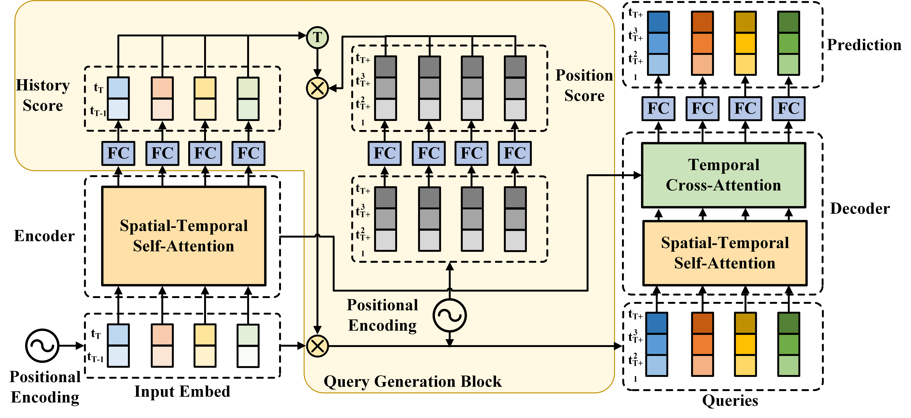
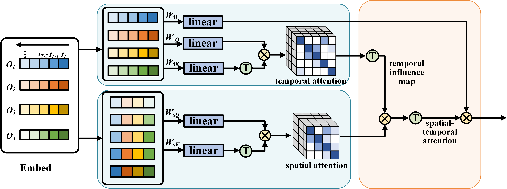

# Non-AR Spatial-Temporal Transformer

## Introduction

Implementation of the paper [NAST: Non-Autoregressive Spatial-Temporal Transformer for Time Series Forecasting](https://arxiv.org/pdf/2102.05624.pdf) (submitted to ICML 2021).

We propose a Non-Autoregressive Transformer architecture for time series forecasting, aiming at overcoming the time delay and accumulative error issues in the canonical Transformer. Moreover, we present a novel spatial-temporal attention mechanism, building a bridge by a learned temporal influence map to fill the gaps between the spatial and temporal attention, so that spatial and temporal dependencies can be processed integrally.





## Requirements
- Python >= 3.6
- CUDA >= 10.2
- PyTorch >= 1.7.0

## Usage

- Install the requirements.
    ```bash
    pip install -r requirements.txt
    ```

- Preparing the NuScenes dataset.
    1. Donload the NuScenes dataset from [here](https://www.nuscenes.org/nuscenes).
    2. Run the NuScenes preprocessing script. (`$NUSCENES_VERSION` is selected from `v1.0-mini`, `v1.0-trainval` or `v1.0-test`)
        ```bash
        python scripts/nuscenes_preprocess.py $YOUR_NUSCENES_DATA_ROOT $SAVE_ROOT -v $NUSCENES_VERSION
        ```
- Preparing the SMARTS-EGO dataset.
    1. This dataset is generated by a [modified SMARTS simulator](https://github.com/Flawless1202/smarts_data_collector).
    2. We will publish the samples used in our experiments, once this paper is accepted.
 
- Train the model with NuScenes dataset.
    ```bash
    python run.py ./configs/non_ar_transformer_nuscenes.py
    ```

- Train the model with SMARTS-EGO dataset.
    ```bash
    python run.py ./configs/non_ar_transformer_smarts.py
    ```
